# BareMetal-OS: Building a Rust Kernel from Scratch

## Architecture Overview


BareMetal-OS is designed with a clear separation of concerns and modular architecture. The system is built from the ground up in Rust, focusing on safety and performance.

## Core Components

### 1. Boot Process
- **Bootloader**: Uses the `bootloader` crate to handle the initial system boot.
- **GDT (Global Descriptor Table)**: Manages memory segmentation.
- **IDT (Interrupt Descriptor Table)**: Handles interrupt routing.

### 2. Memory Management
- **Physical Memory Manager**: Handles raw memory allocation.
- **Virtual Memory**: Implements paging with the following features:
  - Page Table Management
  - Memory Mapping
  - Heap Allocation
- **Memory Allocator**: Supports different allocation strategies:
  - Bump Allocator
  - Linked List Allocator
  - Fixed-Size Block Allocator

### 3. Hardware Abstraction Layer (HAL)
- **VGA Driver**: Manages text-mode display output.
- **Keyboard Driver**: Handles PS/2 keyboard input.
- **UART Driver**: Manages serial communication.
- **PIC**: Manages the Programmable Interrupt Controller.

## Current Features

✅ **Implemented:**
- Bare metal bootloader integration
- Protected mode initialization
- Basic memory management
- VGA text buffer output
- Interrupt handling infrastructure
- Custom global allocator
- Hardware exception handling
- Unit test framework

🚧 **In Progress:**
- Keyboard input handling
- Advanced memory management
- Multi-threading support
- File system basics

## System Requirements

Before running BareMetal-OS, ensure that your system meets the following requirements:

- **Hardware:**  
  - **Architecture:** x86_64 (BareMetal-OS is designed for the x86_64 architecture; while it is primarily tested in emulated environments, adaptations may allow it to run on physical hardware with additional configuration.)
  - **Memory:** At least 512 MB available (this may vary depending on the emulator or physical system settings).

- **Emulation / Virtualization:**  
  - **QEMU:** Recommended (version 6.0 or later) for emulating the hardware environment during development and testing.

- **Storage:**  
  - Sufficient disk space to compile and run the OS.

## Prerequisites

To build and run BareMetal-OS, install the following dependencies:

1. **Rust Nightly Toolchain:**  
   The project requires the nightly version of Rust. Set it up with:
   ```bash
   rustup override set nightly
   ```
2. **Cargo Bootimage::**
   Install the bootimage tool to create bootable disk images:
   ```bash
   cargo install bootimage
   ```
3. **Build Dependencies:**
   All necessary Rust crates are automatically managed by Cargo. For reference, some key dependencies (as seen in the Cargo.lock) include:
   - bootloader
   - lazy_static
   - linked_list_allocator
   - pc-keyboard
   - pic8259
   - spin
   - uart_16550
   - volatile
   - x86_64
   (For a complete list, please review the Cargo.lock file.)

## Building and Running

1. **Building the Project:**
   ```bash
   cargo build
   ```
2. **Creating a Bootable Image:**
   ```bash
   cargo bootimage
   ```
3. **Running the OS in QEMU:**
   ```bash
   cargo run
   ```

## Additional Information

BareMetal-OS is under active development. Future enhancements include more advanced memory management, multi-threading support, and the integration of a basic file system.
